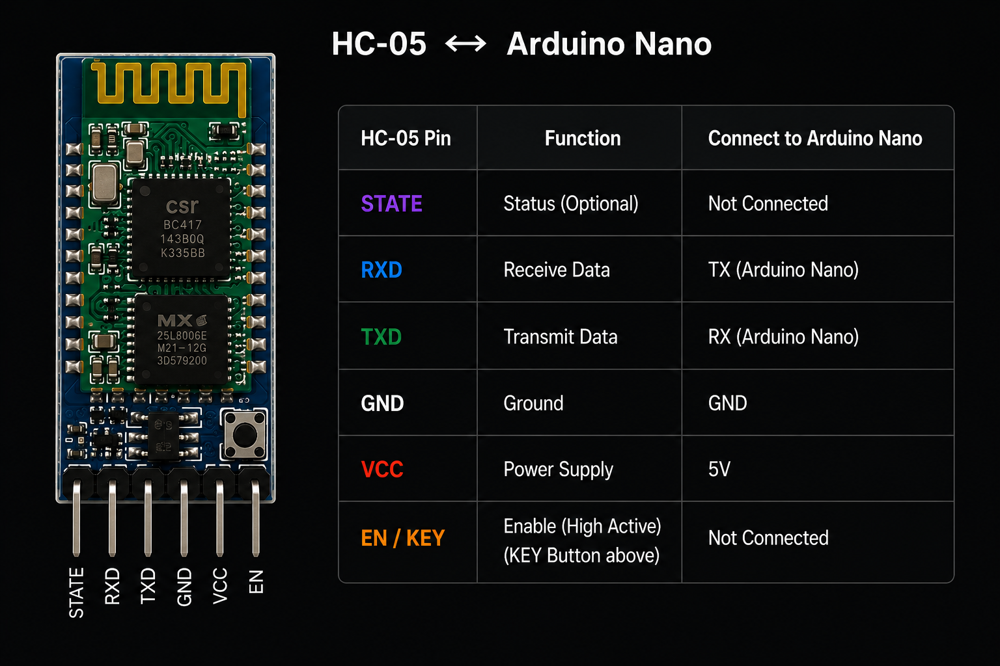

# HC-05 Master–Slave Configuration

This document describes the configuration used to pair two HC-05 Bluetooth modules as a **Master–Slave link** for the RC car.

The **Master** is connected to the controller, while the **Slave** is connected to the RC car. Once configured, the Master can automatically reconnect to the Slave.

---

## Hardware

* 2 × HC-05 Bluetooth modules
* 2 × Arduino Nano
* USB connection for programming the Arduino Nano

---

## 1. Enter AT Mode

The HC-05 must be placed in **AT mode** before changing its configuration.

For each module:

1. Disconnect the HC-05 from power.
2. Press and hold the **KEY/EN button**.
3. Power the module while holding the button.
4. Release the button after the module enters AT mode.
5. The LED will normally blink at a slower rate when AT mode is active.

### Arduino Nano AT-Mode Bridge

Upload this code to the Arduino Nano connected to the HC-05:

```cpp
#include <SoftwareSerial.h>

SoftwareSerial BT(10, 11); // Arduino RX, TX

void setup()
{
    Serial.begin(9600);
    BT.begin(38400);

    Serial.println("HC-05 AT Mode");
    Serial.println("Serial Monitor : 9600");
    Serial.println("HC-05 AT Mode  : 38400");
}

void loop()
{
    if (Serial.available())
    {
        BT.write(Serial.read());
    }

    if (BT.available())
    {
        Serial.write(BT.read());
    }
}
```

The Arduino acts as a simple serial bridge:

```text
PC Serial Monitor
       │
       │ 9600 baud
       ▼
 Arduino Nano
       │
       │ 38400 baud
       ▼
     HC-05
```

Open the Arduino Serial Monitor at:

```text
9600 baud
```

The HC-05 is communicated with internally at:

```text
38400 baud
```

> **Note:** 38400 baud is the commonly used AT-mode baud rate for HC-05 modules. Some HC-05 variants use a different AT-mode baud rate.

### Wiring

Use the wiring diagram below for the Arduino Nano and HC-05 connections.

<p align="center">
  
</p>

#### TX Voltage Divider

The HC-05's **RX input is a 3.3 V logic input**, while the Arduino Nano uses 5 V logic.

To protect the HC-05 RX input, use a voltage divider between:

```text
Arduino Nano TX → HC-05 RX
```

A suitable divider is:

```text
Arduino Nano TX
      │
     1 kΩ
      │
      ├────────── HC-05 RX
      │
     2 kΩ
      │
     GND
```

This produces approximately **3.3 V** at the HC-05 RX pin from the Nano's 5 V TX signal.

The opposite direction does not require a divider:

```text
HC-05 TX → Arduino Nano RX
```

The HC-05's 3.3 V TX signal can be read by the Nano as a HIGH.

> **Important:** The voltage divider is required on the **Arduino TX → HC-05 RX** line, not on the HC-05 TX → Arduino RX line.


### Test AT Communication

With the HC-05 in AT mode, send:

```text
AT
```

Expected response:

```text
OK
```

You can also check the firmware:

```text
AT+VERSION?
```

The exact response depends on the HC-05 firmware.

> If `AT` does not return `OK`, verify that the module is actually in AT mode and that the AT-mode baud rate matches the module.

---

## 2. Configure the Slave

The **Slave** is the HC-05 installed on the RC car.

If the module already has a known configuration, `AT+ORGL` can be skipped.

For a fresh configuration, optionally reset it:

```text
AT+ORGL
```

Configure the Slave:

```text
AT+ROLE=0
AT+NAME=RC_CAR_SLAVE
AT+UART=38400,0,0
```

Now obtain its Bluetooth address:

```text
AT+ADDR?
```

Example response:

```text
+ADDR:1234:56:ABCDEF
```

Save this address. It will be required when configuring the Master.

---

## 3. Configure the Master

The **Master** is the HC-05 installed on the controller.

If required, reset its previous configuration:

```text
AT+ORGL
```

Configure the Master:

```text
AT+ROLE=1
AT+NAME=RC_CAR_MASTER
AT+UART=38400,0,0
```

Set the Slave as the device to connect to:

```text
AT+BIND=<SLAVE_ADDR>
```

Replace `<SLAVE_ADDR>` with the address obtained in the previous step.

For example:

```text
AT+BIND=1234:56:ABCDEF
```

Then enable fixed-address connection mode:

```text
AT+CMODE=0
```

This makes the Master connect to the device specified by `AT+BIND`.

---

## 4. Verify the Configuration

Before leaving AT mode, verify both modules.

### Master

```text
AT+ROLE?
AT+BIND?
AT+CMODE?
AT+UART?
```

The important settings should be:

```text
ROLE  = 1
BIND  = <Slave address>
CMODE = 0
UART  = 9600,0,0
```

### Slave

```text
AT+ROLE?
AT+ADDR?
AT+UART?
```

The important settings should be:

```text
ROLE = 0
ADDR = <Slave address>
UART = 9600,0,0
```

### Final Configuration

```text
Master → ROLE  = 1
Slave  → ROLE  = 0

Master → BIND  = Slave address
Master → CMODE = 0

Both   → UART  = 9600,0,0
```

---

## 5. Return to Normal Mode

Power-cycle both HC-05 modules **without pressing the KEY/EN button**.

They will now start in normal Bluetooth mode.

The Master should attempt to connect automatically to the configured Slave.

Because LED blink patterns vary between HC-05 firmware versions, verify the connection by transferring actual Bluetooth data rather than relying only on the LED.

This is configured using:

```
AT+UART=9600,0,0
```

The project uses `SoftwareSerial` for communication between the Arduino and HC-05.

```
#include <SoftwareSerial.h>

SoftwareSerial BT(RX_PIN, TX_PIN);

void setup()
{
    BT.begin(9600);
};
```
